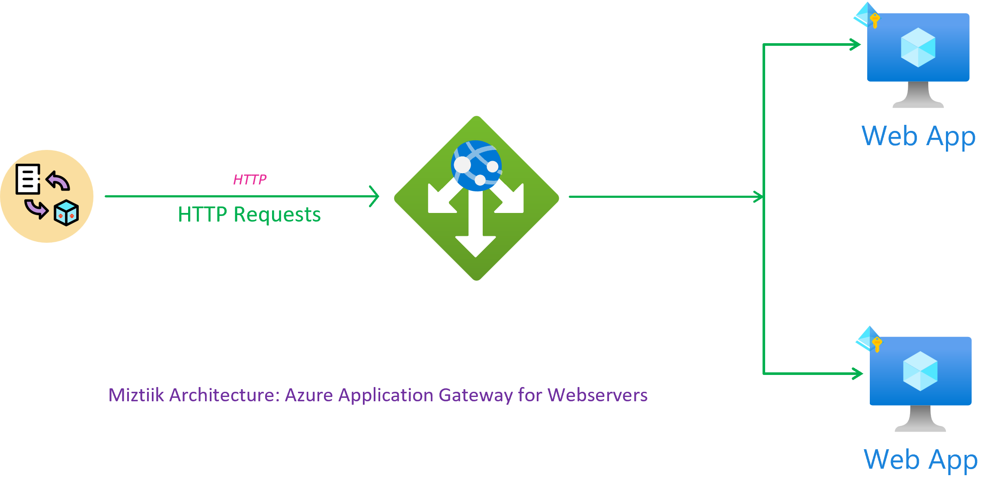
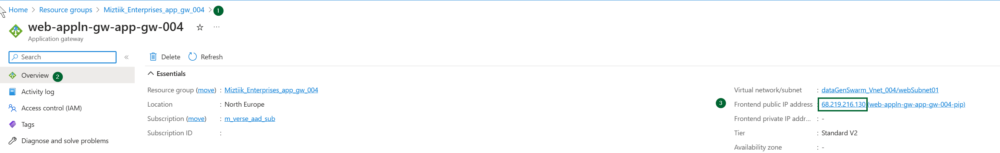
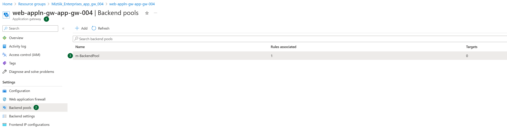
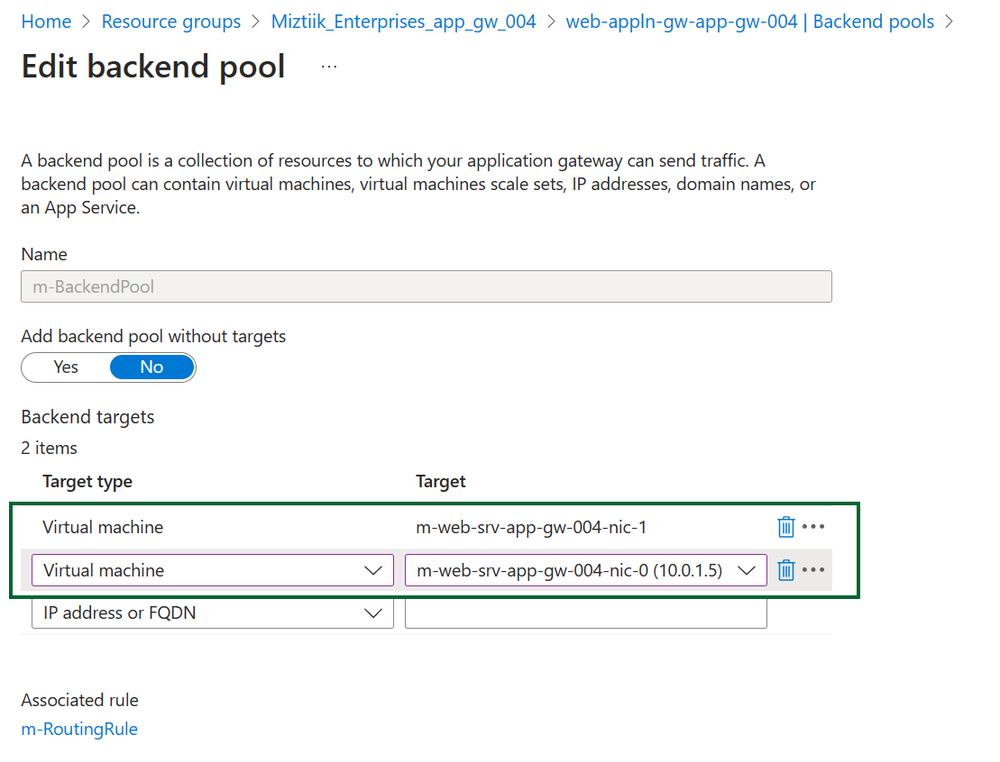
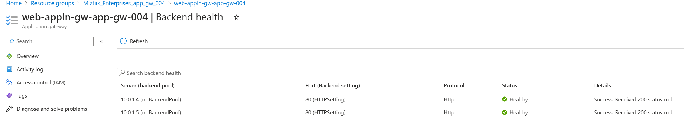
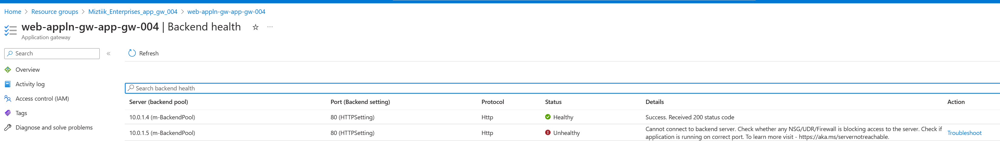
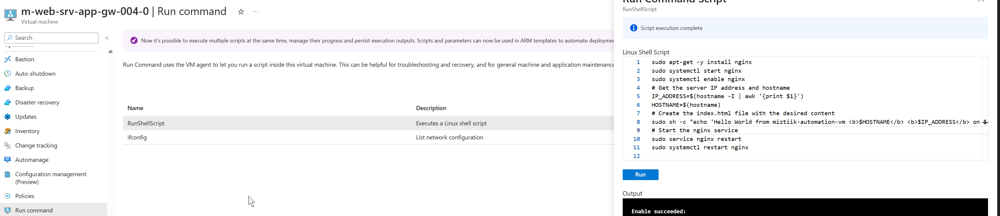
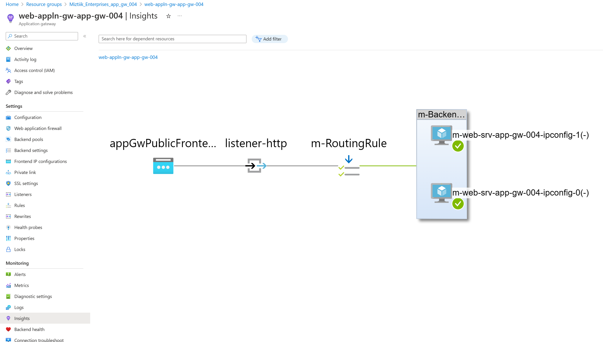

# Azure Application Gateway - Routing Traffic to Web Servers

A simple demonstration to deploy Azure Application Gateway to route traffice to web servers

## 🎯 Solution



1. ## 🧰 Prerequisites

   This demo, along with its instructions, scripts, and Bicep template, has been specifically designed to be executed in the `northeurope` region. However, with minimal modifications, you can also try running it in other regions of your choice (the specific steps for doing so are not covered in this context)

   - 🛠 Azure CLI Installed & Configured - [Get help here](https://learn.microsoft.com/en-us/cli/azure/install-azure-cli)
   - 🛠 Azure Function Core Tools - [Get help here](https://learn.microsoft.com/en-us/azure/azure-functions/functions-run-local?tabs=v4%2Cwindows%2Ccsharp%2Cportal%2Cbash#install-the-azure-functions-core-tools)
   - 🛠 Bicep Installed & Configured - [Get help here](https://learn.microsoft.com/en-us/azure/azure-resource-manager/bicep/install)
     - 🛠 [Optional] VS Code & Bicep Extenstions - [Get help here](https://learn.microsoft.com/en-us/azure/azure-resource-manager/bicep/install#vs-code-and-bicep-extension)
   - `jq` - [Get help here](https://stedolan.github.io/jq/download/)
   - `bash` or git bash - [Get help here](https://git-scm.com/downloads)

2. ## ⚙️ Setting up the environment

   - Get the application code

     ```bash
     git clone https://github.com/miztiik/azure-application-gateway-for-web-servers.git
     cd azure-application-gateway-for-web-servers
     ```

3. ## 🚀 Prepare the local environment

   Ensure you have jq, Azure Cli and bicep working

   ```bash
   jq --version
   func --version
   bicep --version
   bash --version
   az account show
   ```

4. ## 🚀 Deploying the Solution

   - **Stack: Main Bicep**
     The params required for the modules are in `params.json`. Modify them as needed. The helper deployment script `deploy.sh` will deploy the `main.bicep` file. This will create the following resoureces
     - Resource Group(RG)
     - VNet, Subnet & Virtual Machine
       - One Subnet dedicated for the Flexible MySQL Server
     - Virtual Machine(Ubuntu) - `1` - Defined in `params.json` named `vmCount`
        - Bootstrapped with custom libs using `userData` script - Installs Nginx
        - Install Azure Monitoring Agent
     - User Managed Identity - Identity attached to the VM with the following permissions,
        - Monitoring Metrics Publisher
     - Azure Application Gateway
         - Frontend IP Config
         - Backend Pool
         - HTTP Settings
         - Listener
         - Rule
         - Health Probe
         - Diagnostic Settings

      I couldn't figure out a way to add the VMs to the backend pool all in the same template. Will have to figure out a way to do it. For now, I have added the VMs to the backend pool manually after the deployment.

     **Note** - I hacked the template from another repo of mine, so you will see some unused resources(log analytics workspace/queues etc.,). _You can safely ignore them, But do remember to clean up your Resource Group to avoid unnecessary costs._

    ```bash
    # make deploy
    sh deployment_scripts/deploy.sh
    ```

     After successfully deploying the stack, Check the `Resource Groups/Deployments` section for the resources.

5. ## 🔬 Testing the solution

   - You can find the Application Gateway Public IP name from the resource blade.

      
      
      
      

      ```bash
      APP_GW_PUBLIC_IP="m-web-srv-app-gw-004-pip"
      for i in {1..100};
       do 
       curl ${APP_GW_PUBLIC_IP}
       sleep 2
      done
      ```

      You should see the output like this, You can see the traffic being routed to both the VMs (_check the ip address and the hostname_)

      ```text
      Hello World from miztiik-automation-vm <b>m-web-srv-app-gw-004-1</b> <b>10.0.1.4</b> on Mon May 29 14:39:46 UTC 2023 
      Hello World from miztiik-automation-vm <b>m-web-srv-app-gw-004-1</b> <b>10.0.1.4</b> on Mon May 29 14:39:46 UTC 2023 
      Hello World from miztiik-automation-vm <b>m-web-srv-app-gw-004-0</b> <b>10.0.1.5</b> on Mon May 29 14:48:36 UTC 2023 
      Hello World from miztiik-automation-vm <b>m-web-srv-app-gw-004-0</b> <b>10.0.1.5</b> on Mon May 29 14:48:36 UTC 2023 
      Hello World from miztiik-automation-vm <b>m-web-srv-app-gw-004-1</b> <b>10.0.1.4</b> on Mon May 29 14:39:46 UTC 2023 
      Hello World from miztiik-automation-vm <b>m-web-srv-app-gw-004-0</b> <b>10.0.1.5</b> on Mon May 29 14:48:36 UTC 2023 
      Hello World from miztiik-automation-vm <b>m-web-srv-app-gw-004-1</b> <b>10.0.1.4</b> on Mon May 29 14:39:46 UTC 2023 
      Hello World from miztiik-automation-vm <b>m-web-srv-app-gw-004-1</b> <b>10.0.1.4</b> on Mon May 29 14:39:46 UTC 2023 
      Hello World from miztiik-automation-vm <b>m-web-srv-app-gw-004-0</b> <b>10.0.1.5</b> on Mon May 29 14:48:36 UTC 2023 
      Hello World from miztiik-automation-vm <b>m-web-srv-app-gw-004-0</b> <b>10.0.1.5</b> on Mon May 29 14:48:36 UTC 2023 
      Hello World from miztiik-automation-vm <b>m-web-srv-app-gw-004-1</b> <b>10.0.1.4</b> on Mon May 29 14:39:46 UTC 2023 
      ```

      **Troubleshooting** : Occasionally the bootstrap script will fail to install the Nginx, resuling in health probe failure. You can check the health probe status from the `Application Gateway/Backend Health` section. If you see the health probe failing, you can SSH into the VM and install Nginx manually. You can also check the logs from the VM in the `Application Gateway/Backend Health` section.

      

      You can nudge the vm by using the run command,
      
      
      

6. ## 📒 Conclusion

   In this demonstration, we have shown how to build vms and load balance the traffic using application gateway..
  
7. ## 🧹 CleanUp

   If you want to destroy all the resources created by the stack, Execute the below command to delete the stack, or _you can delete the stack from console as well_

   - Resources created during [Deploying The Solution](#-deploying-the-solution)
   - _Any other custom resources, you have created for this demo_

   ```bash
   # Delete from resource group
   az group delete --name Miztiik_Enterprises_xxx --yes
   # Follow any on-screen prompt
   ```

   This is not an exhaustive list, please carry out other necessary steps as maybe applicable to your needs.

## 📌 Who is using this

This repository aims to show how to Bicep to new developers, Solution Architects & Ops Engineers in Azure.

### 💡 Help/Suggestions or 🐛 Bugs

Thank you for your interest in contributing to our project. Whether it is a bug report, new feature, correction, or additional documentation or solutions, we greatly value feedback and contributions from our community. [Start here](/issues)

### 👋 Buy me a coffee

[](https://ko-fi.com/Q5Q41QDGK) Buy me a [coffee ☕][900].

### 📚 References

1. [Azure Docs: Just In Time Access][10]

### 🏷️ Metadata


**Level**: 100

[10]: https://learn.microsoft.com/en-us/azure/defender-for-cloud/just-in-time-access-usage

[100]: https://www.udemy.com/course/aws-cloud-security/?referralCode=B7F1B6C78B45ADAF77A9
[101]: https://www.udemy.com/course/aws-cloud-security-proactive-way/?referralCode=71DC542AD4481309A441
[102]: https://www.udemy.com/course/aws-cloud-development-kit-from-beginner-to-professional/?referralCode=E15D7FB64E417C547579
[103]: https://www.udemy.com/course/aws-cloudformation-basics?referralCode=93AD3B1530BC871093D6
[899]: https://www.udemy.com/user/n-kumar/
[900]: https://ko-fi.com/miztiik
[901]: https://ko-fi.com/Q5Q41QDGK